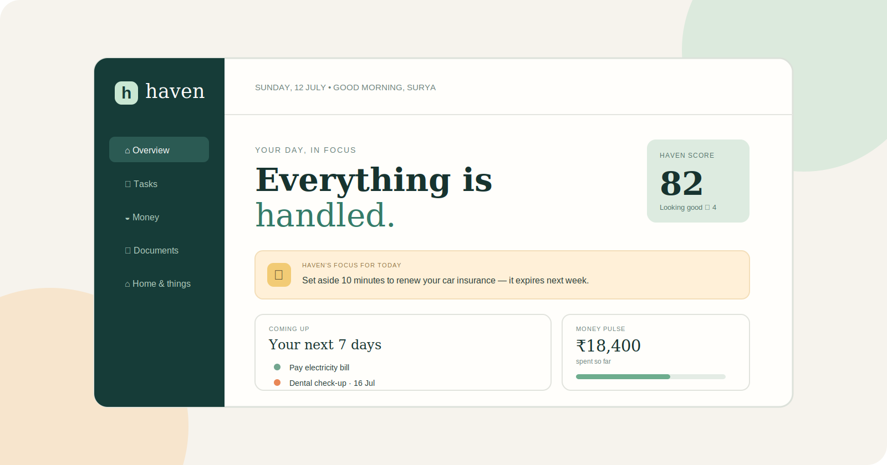

<div align="center">



# Haven

### Your life, beautifully organised.

<a href="#features">Explore features</a> · <a href="#quick-start">Quick start</a> · <a href="#deploy-to-github-pages">Publish it</a>

<br />


</div>

> **Haven** is a calm, one-page personal dashboard that turns life admin into a simple daily ritual. Keep tabs on tasks, bills, documents, warranties and home maintenance—without the clutter.

<div align="center">
  <b>Created by Suryandu Ganguly</b>
</div>

## 🆕 What's new — v1.1.0 (July 2026)

This release focuses on making Haven feel more alive and keeping your data safer:

| Change | Details |
| :--- | :--- |
| 💾 **Backup & restore** | New **Settings → Your data** section. Download your entire Haven (tasks, bills, documents, settings) as a JSON file and restore it on any device — real data portability, no cloud needed. |
| 📈 **A real Haven score** | The dashboard score is no longer a fixed number — it's now computed from your life: completed tasks raise it, urgent open tasks lower it, and staying within budget gives it a boost. |
| 🌅 **Time-aware greeting** | Haven now says *Good morning / afternoon / evening* based on your clock, in all three languages (English, Hindi, Bengali). |
| 🌙 **Follows your system theme** | On your very first visit, Haven matches your device's dark/light preference automatically. |
| ⌨️ **Escape to close** | Any open modal, settings panel or the AI panel now closes with the `Esc` key. |
| ♿ **Keyboard focus rings** | Clear, theme-aware focus outlines for keyboard navigation — without cluttering mouse use. |
| ✨ **Smooth theme switching** | Cards, panels and surfaces now fade gently between light and dark instead of snapping. |
| 🔍 **Better sharing & SEO** | Added meta description, Open Graph tags, a browser `theme-color`, and a proper favicon (the little "h" now shows in your browser tab). |

## ✨ Why Haven?

Most to-do apps make life feel like more work. Haven is deliberately different: warm, quiet, and focused on the small practical details that keep your life running smoothly.

<table>
  <tr>
    <td width="50%">
      <h3>☀️ A calmer daily view</h3>
      Start with one meaningful priority, your next commitments, and a simple wellbeing-style Haven score.
    </td>
    <td width="50%">
      <h3>🧠 Remember the forgettable stuff</h3>
      Insurance renewals, warranties, subscriptions, service dates and documents stay visible before they become urgent.
    </td>
  </tr>
</table>

## Features

| Area | What it helps with |
| :--- | :--- |
| 🔐 **Google Sign-In** | Sign in with Google to greet you by name and, with permission, pull your profile details (name, email, photo, date of birth, location). A built-in local sign-in keeps the app working even before you add a client ID. |
| ☁️ **Cross-device sync** | Every task, bill, document and setting is stored per Google account, so signing in on another device restores the same space. |
| 🏡 **Overview** | Daily focus, coming-up timeline, action centre, money pulse and vault alerts. |
| ✅ **Tasks & reminders** | **Add and delete** tasks, filter your list, and check work off as it gets done. |
| 💳 **Money pulse** | **Your own numbers** — enter spending, upcoming and budget figures; add and delete bills. |
| 🗂️ **Document vault** | **Add and delete** documents with **customisable categories** (All / Insurance / Warranties / Home + your own). |
| 🔧 **Home & things** | **Add and delete** items — servicing, maintenance, warranties and belongings. |
| 📅 **Add to Calendar** | Every task and bill has a one-tap **Add to Google Calendar** link. |
| 💬 **WhatsApp reminders** | Auto-generated **WhatsApp reminder** message for any task or bill, sent to your saved number. |
| 🌗 **Dark & light mode** | Just two clean themes — both fully readable — with a one-tap toggle. |
| 📱 **Responsive design** | A thoughtful desktop layout that adapts smoothly for mobile. |

## 🔐 Enable real Google login

Out of the box the app uses a **built-in local sign-in** so it runs anywhere with no setup. To switch on genuine Google Sign-In:

1. Open the [Google Cloud Console → Credentials](https://console.cloud.google.com/apis/credentials).
2. Create an **OAuth 2.0 Client ID** of type **Web application**.
3. Under **Authorised JavaScript origins**, add your site URL, e.g. `https://YOUR-USERNAME.github.io`.
4. Copy the client ID and paste it into `app.js`:
   ```js
   const GOOGLE_CLIENT_ID = "YOUR-ID.apps.googleusercontent.com";
   ```
5. Commit and reload — the real Google button appears automatically.

> [!NOTE]
> Google returns name, email and profile photo from the basic sign-in. Date of birth and location are only shared when your Google account exposes them and you grant permission; the app also lets you fill these in manually in **Settings → Your details**, and they're saved to your account.

## A little tour

```text
              YOUR DAY, IN FOCUS
  ┌───────────────────────────────────────────┐
  │  ✦ Renew car insurance before it expires  │
  └───────────────────────────────────────────┘

   Coming up                 Action center
   • Pay electricity bill    ! Car insurance
   • Dental check-up         ! Dental check-up
   • Netflix renewal         ! Netflix plan
```

## Quick start

Haven has no installation step, build tool, package manager or database to configure.

```bash
git clone https://github.com/YOUR-USERNAME/haven-life-admin.git
cd haven-life-admin
```

Then open **`index.html`** in your favourite browser.

> [!TIP]
> For the best local experience, open the folder in VS Code and use its **Live Server** extension. It is optional—the app works by simply opening `index.html`.

## Deploy to GitHub Pages

Make your own live version in a few minutes:

1. Create a public GitHub repository named `haven-life-admin`.
2. Upload every file from this folder, including the `assets` folder.
3. In the repository, go to **Settings → Pages**.
4. Under **Build and deployment**, select **Deploy from a branch**.
5. Select branch **`main`** and folder **`/(root)`**, then select **Save**.

Your dashboard will be live at:

```text
https://YOUR-GITHUB-USERNAME.github.io/haven-life-admin/
```

## Project structure

```text
haven-life-admin/
├── index.html              # App layout and content
├── style.css               # Design system, dark/light themes, responsive styles
├── app.js                  # Google login, per-account data, add/delete, calendar & WhatsApp
├── assets/
│   └── haven-dashboard.svg # README dashboard artwork
└── README.md
```

## Built with intention

- **Zero build step** — plain HTML, CSS and JavaScript; the only external script is Google's official Sign-In library.
- **Your data stays in your browser** — everything is saved in `localStorage`, namespaced per Google account.
- **Privacy-friendly** — no analytics, no third-party tracking.

## What could come next?

- [x] Persistent tasks and reminders (localStorage)
- [x] Google login
- [x] Add & delete across every section
- [x] Customisable vault categories
- [x] Add-to-Calendar and WhatsApp reminders
- [x] Dark & light mode
- [x] Backup & restore (JSON export/import)
- [x] Live Haven score computed from your real data
- [ ] True cloud sync via Firebase/Supabase (currently per-device, keyed by account)
- [ ] Upload real document files and receipt scanning
- [ ] Push notifications for reminders

---

<div align="center">
  <sub>Created by Suryandu Ganguly · Made for calmer days and fewer forgotten things. 🌿</sub>
</div>
